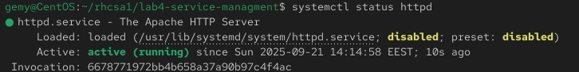
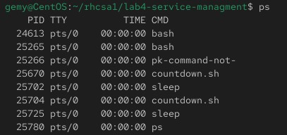
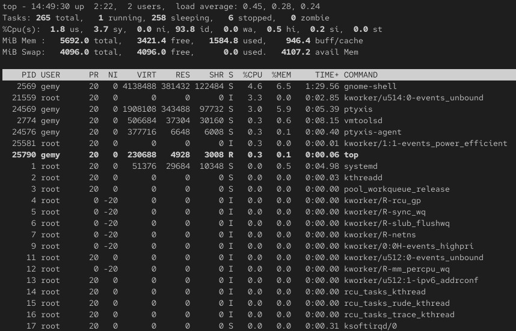

# Lab 4: service managment

## Objective

- Install and configure httpd (Apache). 
- Set it to start on boot.  
- write script and run (fg , bg)
- print run process and kill one 

## Steps

  ### 1. Install httpd (Apache).
  ```bash
     sudo yum install httpd
     or
     dnf install httpd
```
[](Images/1.jpg)


  ### 2. run httpd and check status
  ```bash
     sudo systemctl start httpd
     sudo systemctl status httpd
  ```
[](Images/2.jpg)

  ### 3. Set it to start on boot
  ```bash
     sudo systemctl enable httpd
  ```
- apache run auto for each boot

  ### 4. write script  
[](Images/3.jpg)
  - print numbers from 10 to 1    

  ### 5. make file executable   
  ```bash
     sudo chmod +x countdown.sh
  ```
    
  ### 6. execute file (fg , bg)
  ```bash
      ./countdown.sh        (fg)
      ./countdown.sh &      (bg)
  ```

  ### 7. display process
  - using ps  => display snapshot of running process
```bash
ps
```
[](Images/ps.jpg)

- using top  => diplay process live
```bash
top
```
[](Images/top.jpg)

### 8. kill process 
```bash
kill 25670
```
   


## challenges 
I didn’t manage to write the script this time, but I learned how to run and manage processes, which I will apply in future tasks.
 


