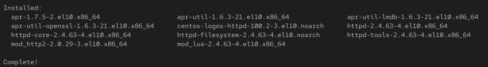

# Lab 3: service managment

## Objective

- Install and configure httpd (Apache). 
- Set it to start on boot.  
- write script and run (fg , bg)
- print run process and kill one 

## Steps

  ### 1. Install and configure httpd (Apache).
  ```bash
     sudo yum install httpd
     or
     dnf install httpd
```
[](Images/1.jpg)


  ### 2. change projX directory owner , group and SUID
  ```bash
     sudo chgrp developers projX
     sudo chown omar projX
     chmod u+s projX
  ```
[](Images/3.jpg)

  ### 3. add permission to alice on projY 
  ```bash
     sudo setfacl -m u:alice:rwx projY
  ```
[](Images/4.jpg)


  ### 4. control default permission 
   #### 1. temporary
  ```bash
   umask 002
  ```
  - when create directory (777-umask) and file (666-umask)
    
[](Images/7.jpg)

  #### 2. permenant for one user 
  - modify bashrc file
    
[](Images/6.jpg)
    
  #### 3. permenant for all users  
  
  - modify /etc/profile 


    
 

