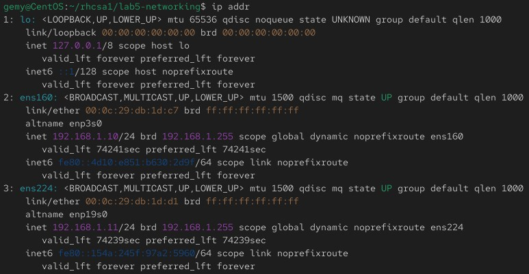
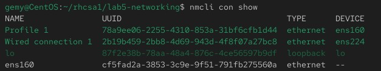
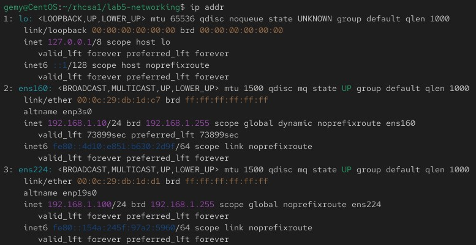
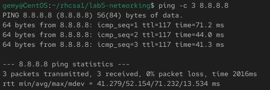
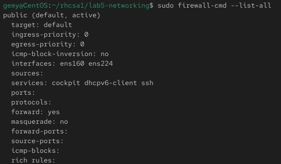

# Lab 5: networking

## Objective

- Configure static IP on your VM. 
- Test connectivity with ping, curl.  
- Use firewalld to open/close ports (e.g., allow SSH, block HTTP).


## Steps

  ### 1. show network interfaces and ip addresses
  ```bash
     sudo ip addr
```
[](Images/ipa.jpg)


  ### 2. list saved network connection on system and add static ip 
  ```bash
     nmcli con list
  ```
[](Images/nmcli.jpg)

```bash
nmcli con mod "Wired connection 1" ipv4.addresses 192.168.1.100/24
nmcli con mod "Wired connection 1" ipv4.gateway 192.168.1.1
nmcli con mod "Wired connection 1" ipv4.dns 8.8.8.8
nmcli con mod "Wired connection 1" ipv4.method manual
nmcli con up "Wired connection 1"
```
[](Images/ipb.jpg)

  ### 3. test connectivity
  ```bash
     ping -c 3 8.8.8.8
  ```
[](Images/ping.jpg)
  ```bash
     curl http://google.com
  ```

  ### 4. allow ssh and block http 
  ```bash
  sudo firewall-cmd --permanent --add-service=ssh
  sudo firewall-cmd --reload
  sudo firewall-cmd --permanent --remove-service=http
  sudo firewall-cmd --reload
  ```  

  ### 5. show firewall rule   
  ```bash
  sudo firewall-cmd --list-all
  ```
[](Images/firewall.jpg)
   


## challenges 
I realized I often forgot to run firewall-cmd --reload. This helped me understand that changes are not applied until the firewall is reloaded.


 

